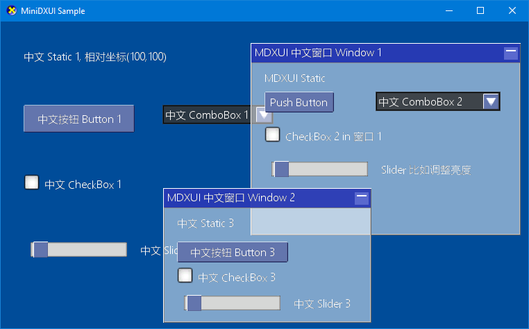

# MDXUI
---
Mini DirectX UI (MDXUI for short) is a simple library for creating basic UI within D3D11 application.


### Basic Usage


``` cpp

	// need to define a message handler for responsing UI widget's messages.
	ULONG CALLBACK EventCb(UINT msg, UINT ControlId, ULONG_PTR wParam, ULONG_PTR lParam)
	{
		switch (ControlId)
		{
		case ID_BUTTON:
			MessageBoxW(nullptr, L"button", L"info", MB_OK);
			break;
		}
		return 0;
	}

	int main()
	{
		ID3D11Device* dev;
		// Create and initialize D3D11
		// ...

		// initialize MDXUI, witch created D3D11 device and message handler(EventCb() here for example )
		MDXUI g_MDXUI = new MDXUI(dev, width, height, EventCb);

		// create widget on root
		g_MDXUI->CreateStatic(nullptr, 100, 20, L"中文 Static 1");
		g_MDXUI->CreateButton(nullptr, 100, 100, 160, 40, L"中文按钮 Button 1", ID_BUTTON);
		g_MDXUI->CreateSlider(nullptr, 100, 300, 160, L"中文 Slider 1", ID_SLIDER);
		g_MDXUI->CreateCheckbox(nullptr, 100, 200, L"中文 CheckBox 1", ID_CHKBOX);

		// create a comboBox
		MDXUICombobox * cmb0 = g_MDXUI->CreateCombobox(nullptr, 300, 100, 160, L"中文 ComboBox 1", ID_COMBOX);
		// add items to the ComboBox
		cmb0->AddString(L"item 1");
		cmb0->AddString(L"item 2");
		cmb0->AddString(L"item 3");

		// create window and sub-widgets
		MDXUIWindow * wnd = g_MDXUI->NewWindow(500, 380, 300, 200, L"MDXUI 中文窗口 Window 1");
		wnd->CreateButton(20, 60, 160, 30, L"中文按钮 Button in window", ID_MISC_BUTTON);
		wnd->CreateCheckbox(20, 120, L"中文 CheckBox 3", ID_MISC_CHKBOX);

		// ...

		// render in main message loop
		// while (1)
		// {
		//	renderScene();
				g_MDXUI->Render();
		//	present();
		// }

		// ...
		delete g_MDXUI;
		// ...
	}

```

### TODO
- set visibility
- window close button
- set text color
- re-org include files
- save/restore IA (Layout/VB/IB/Topology), in case app not set for each frame.

### Snapshot
<!--  -->



### notes
Leverage DDSLoader and SimpleMath in [DXTK](https://github.com/Microsoft/DirectXTK "DirectXTK").
